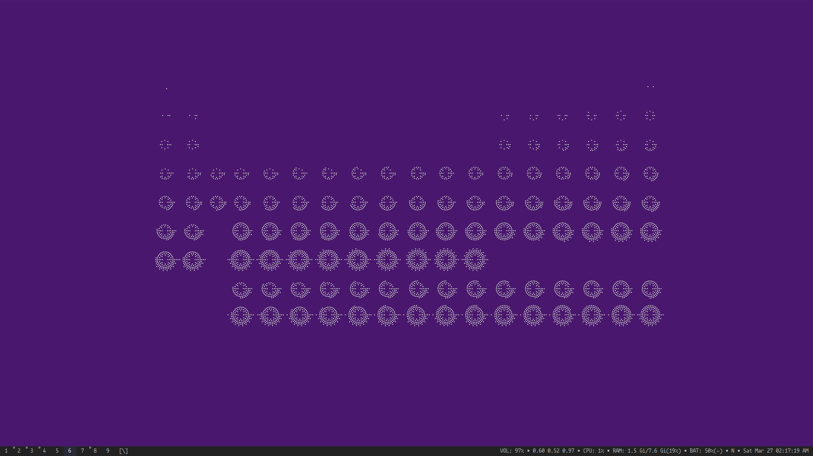

# @rsapkf's dotfiles

This repository contains my dotfiles for:

- [Alacritty](https://github.com/jwilm/alacritty) - Terminal Emulator
- [neovim](https://github.com/neovim/neovim) - hyperextensible Vim-based Text Editor
- [tmux](https://github.com/tmux/tmux) - Terminal Multiplexer
- [Zsh](https://sourceforge.net/p/zsh/code/ci/master/tree) - Shell
- [oh-my-zsh](https://github.com/robbyrussell/oh-my-zsh) - Framework for managing Zsh
- [sxhkd](https://github.com/baskerville/sxhkd) - Simple X Hotkey Daemon
- [rofi](https://github.com/davatorium/rofi) - Program Launcher
- [newsboat](https://github.com/newsboat/newsboat) - RSS/Atom Feed Reader
- [zathura](https://github.com/pwmt/zathura) - Document Viewer
- [neomutt](https://github.com/neomutt/neomutt) - Email Client
- [htop](https://github.com/hishamhm/htop) - Interactive Process Viewer
- [ranger](https://github.com/ranger/ranger) - File Browser
- [irssi](https://github.com/irssi/irssi) - IRC Client
- [weechat](https://github.com/weechat/weechat) - Chat Client
- [qutebrowser](https://github.com/qutebrowser/qutebrowser) - Keyboard-driven Vim-like Browser
- [neofetch](https://github.com/dylanaraps/neofetch) - System Info Script
- [compton](https://github.com/chjj/compton) - Composite Manager
- [conky](https://github.com/brndnmtthws/conky) - System Monitor

The `.suckless` directory contains my builds of suckless tools including all the patches.

- [dwm](https://git.suckless.org) - dynamic window manager
- [slstatus](https://git.suckless.org) - Statusbar for dwm
- [st](https://git.suckless.org/) - simple terminal
- [dmenu](https://git.suckless.org) - Dynamic Menu for X
- [slock](https://git.suckless.org) - Simple X display locker
- [surf](https://git.suckless.org) - Simple web browser
- [tabbed](https://git.suckless.org) - Simple generic tabbed frontend to xembed-aware applications
- [sent](https://git.suckless.org) - Simple plaintext presentation tool
- [dwmstatus](https://git.suckless.org) - Statusbar for dwm

I sparsely use these tools now. The config files are here for reference:

- [bash](https://www.gnu.org/software/bash) - Shell
- [fish](https://github.com/fish-shell/fish-shell) - Shell
- [vim](https://github.com/vim/vim) - Text Editor
- [Emacs](https://www.gnu.org/software/emacs) - Text Editor
- [xmonad](https://github.com/xmonad/xmonad) - Window Manager
- [xmobar](https://github.com/jaor/xmobar) - Status Bar for xmonad
- [i3wm](https://github.com/i3/i3) - Window Manager
- [i3-gaps](https://github.com/Airblader/i3) - i3 with more features
- [bspwm](https://github.com/baskerville/bspwm) - Window Manager
- [polybar](https://github.com/polybar/polybar) - Status Bar
- [i3blocks](https://github.com/vivien/i3blocks) - Status Bar
- [urxvt/rxvt-unicode](http://software.schmorp.de/pkg/rxvt-unicode.html) - Terminal
- [termite](https://github.com/thestinger/termite) - Terminal Emulator

## Managing dotfiles

Currently, I use a [bare git repository](https://news.ycombinator.com/item?id=11070797) in my home directory to track my dotfiles (detailed guide [here](https://www.atlassian.com/git/tutorials/dotfiles)). In the past I used [GNU Stow](https://www.gnu.org/software/stow/manual/stow.html) to do so.

## TODO

- Setup/Install Script
- Switch to vim-packages
